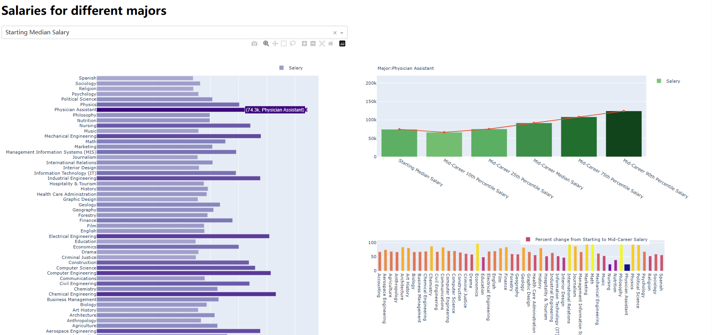
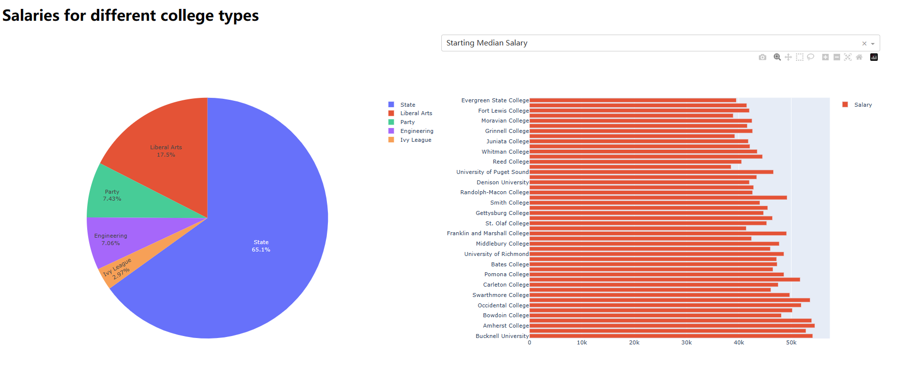
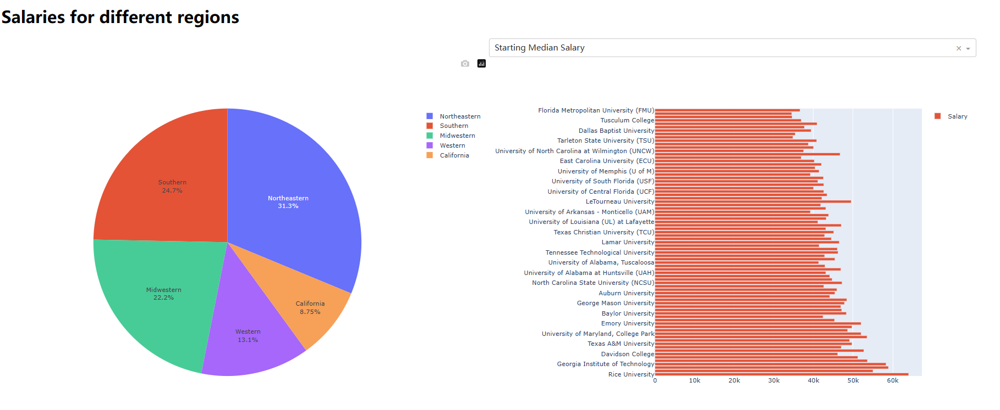
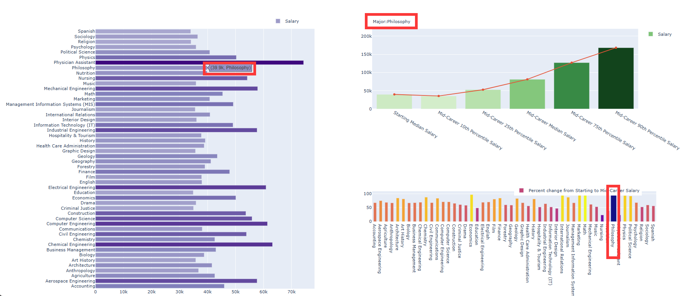
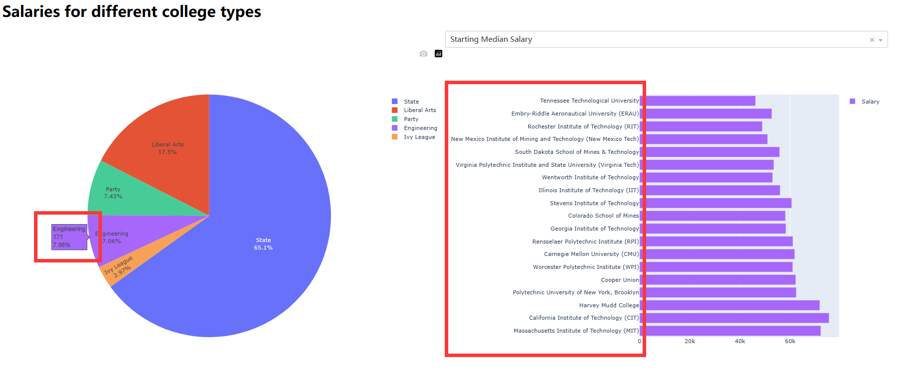
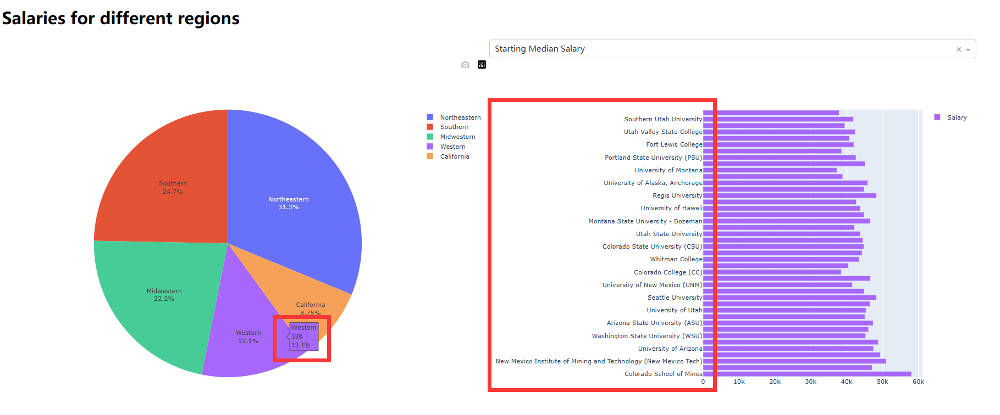

# Lab3 Data Visualization

## 1 Data set description

### 1.1 Introduction

The subject of the data set selected in the experiment is the employment salary of college students and  all data was obtained from the Wall Street Journal based on data from Payscale, Inc. 

The data set contains three data tables: 

1. Salary Increase By Major

| Undergraduate Major | Starting Median Salary | Mid-Career Median Salary | Percent change from Starting to Mid-Career  Salary | Mid-Career 10th Percentile Salary | Mid-Career 25th Percentile Salary | Mid-Career 75th Percentile Salary | Mid-Career 90th Percentile Salary |
| ------------------- | ---------------------- | ------------------------ | -------------------------------------------------- | --------------------------------- | --------------------------------- | --------------------------------- | --------------------------------- |
| Accounting          | $46,000.00             | $77,100.00               | 67.6                                               | $42,200.00                        | $56,100.00                        | $108,000.00                       | $152,000.00                       |

2. Salary Increase By Type of College

| School Name                                  | School Type | Starting Median Salary | Mid-Career Median Salary | Mid-Career 10th Percentile Salary | Mid-Career 25th Percentile Salary | Mid-Career 75th Percentile Salary | Mid-Career 90th Percentile Salary | size |
| -------------------------------------------- | ----------- | ---------------------- | ------------------------ | --------------------------------- | --------------------------------- | --------------------------------- | --------------------------------- | ---- |
| Massachusetts Institute of Technology  (MIT) | Engineering | 72200                  | 126000                   | 76800                             | 99200                             | 168000                            | 220000                            | 2    |

3. Salaries By Region

| School Name         | Region     | Starting Median Salary | Mid-Career Median Salary | Mid-Career 10th Percentile Salary | Mid-Career 25th Percentile Salary | Mid-Career 75th Percentile Salary | Mid-Career 90th Percentile Salary |
| ------------------- | ---------- | ---------------------- | ------------------------ | --------------------------------- | --------------------------------- | --------------------------------- | --------------------------------- |
| Stanford University | California | $70,400.00             | $129,000.00              | $68,400.00                        | $93,100.00                        | $184,000.00                       | $257,000.00                       |

### 1.2 Characteristic

- The first set of data describes the salary differences among different majors, which are measured by the indicators `Starting Median Salary`、`Mid-Career Median Salary`、`Percent change from Starting to Mid-Career  Salary`、`  Mid-Career 10th Percentile Salary`、` Mid-Career 25th Percentile Salary`、 `Mid-Career 75th Percentile Salary`、`Mid-Career 90th Percentile Salary`。
- In the latter two sets of data, the salaries of different schools were described, along with information about school type and region. Its indicators of salaries is almost identical to the first set.

## 2 Dashboard design

### 2.1 Charts setting

For the first set of data, three charts are designed to describe it.

- The vertical bar chart on the left shows salaries for different majors, the indicators can be adjusted through the selection box at the top
- The bar chart in the upper right describes the values of all the indicators in a particular major
- The bar chart in the lower right describes the `Percent change from Starting to Mid-Career Salary` of all majors

For the second set of data, two charts are designed to describe it.

- The pie chart on the left depicts the percentage of different school types
- The vertical bar chart on the right shows salaries for different schools, the indicators can be adjusted through the selection box at the top

For the third set of data, two charts are designed to describe it.

- The pie chart on the left depicts the percentage of different school regions
- The vertical bar chart on the right shows salaries for different schools, the indicators can be adjusted through the selection box at the top

### 2.2 User interaction

- When the user hovers over the major data in the bar chart on the right, The two graphs on the right will change in sync
  - The bar chart in the upper right shows salary indicators for the chosen major
  - The bar chart in the lower right corner will show the selected major data bolded and deepened

- When the user hovers over a school type in the pie chart on the left, the schools contained in the bar chart on the right will be changed to those of this type
- The color of the bar chart is also relative to the color of the pie chart to facilitate user identification

- When the user hovers over a school region in the pie chart on the left, the schools contained in the bar chart on the right will be changed to those of this region
- The color of the bar chart is also relative to the color of the pie chart to facilitate user identification

